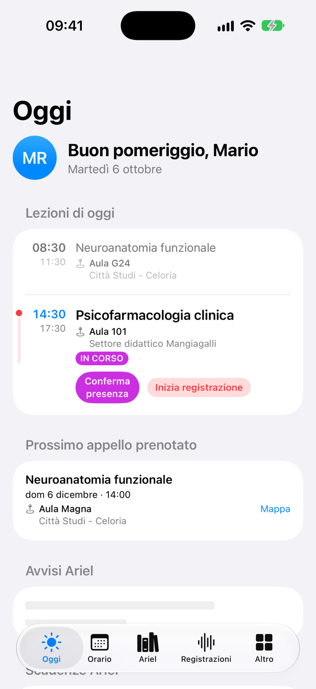
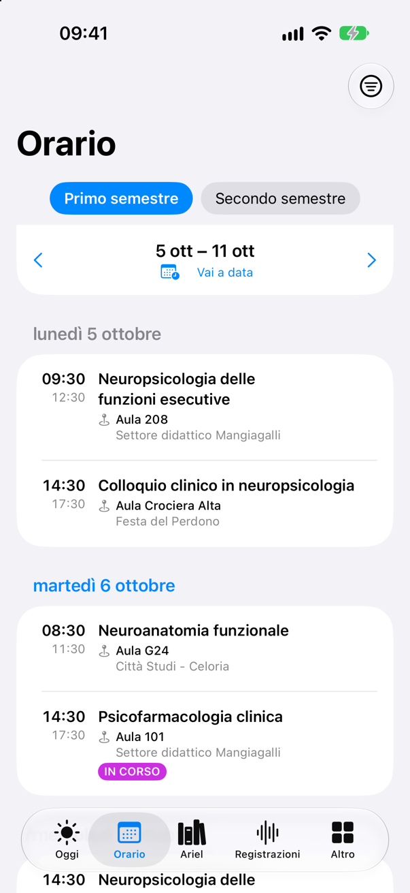
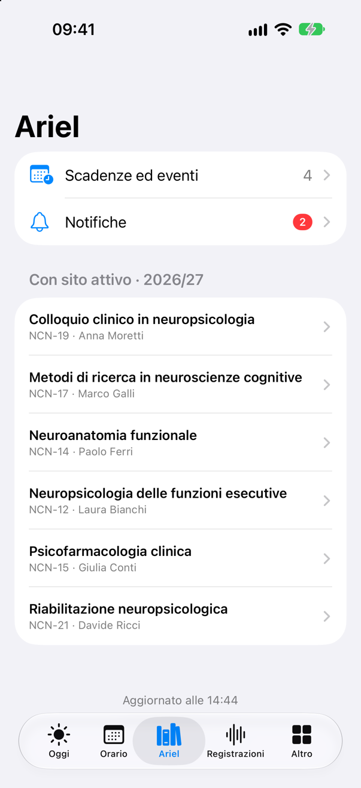
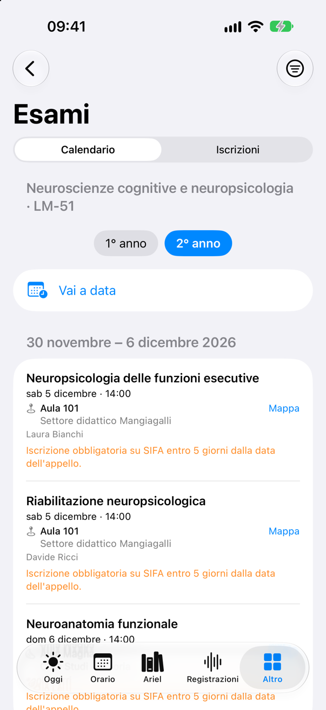
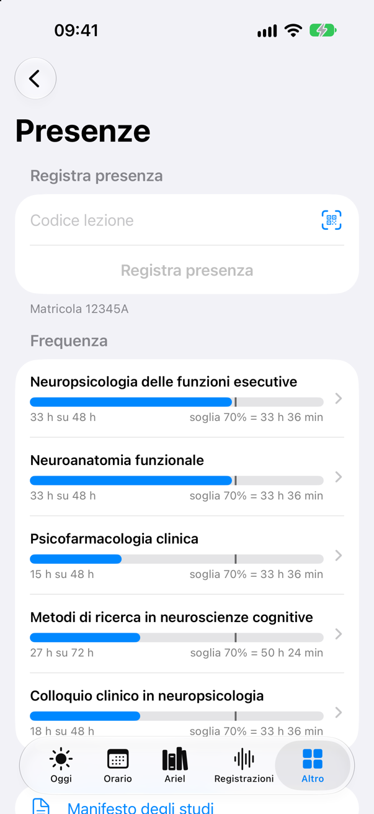
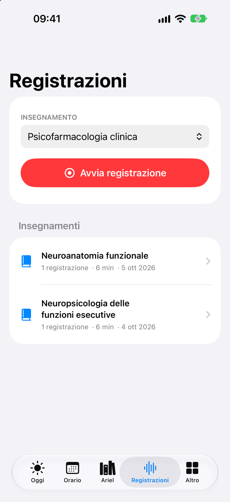
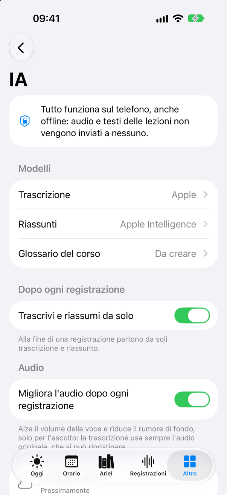
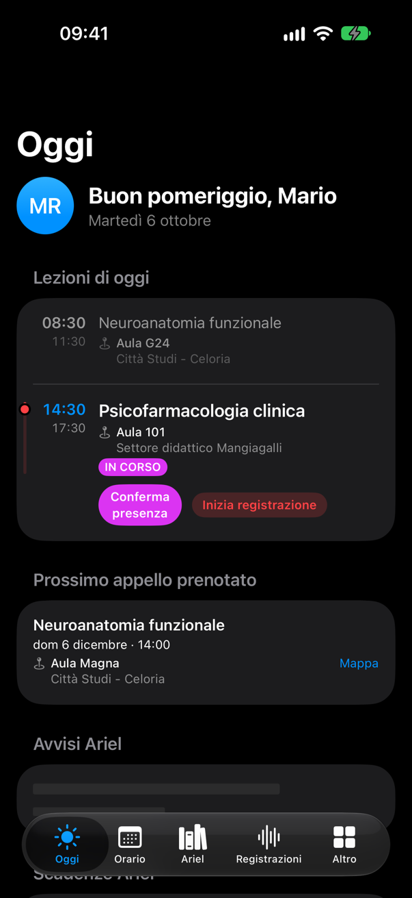

<p align="center">
  
</p>

<h1 align="center">Statale Plus</h1>

<p align="center">
  <b>Tutto quello che serve a chi studia alla Statale di Milano, in un'unica app iOS nativa.</b><br>
  Orario, esami, presenze e siti dei corsi, più le registrazioni delle lezioni con trascrizione sul telefono e riassunti con l'IA.
</p>

<p align="center">
  <a href="https://github.com/mattmeligeni/StatalePlus/actions/workflows/compila.yml"></a>
  
  
  
  
  
  
  <a href="LICENSE"></a>
</p>

<p align="center"><a href="README.md">English</a> · <b>Italiano</b></p>

> [!NOTE]
> Statale Plus è un progetto **indipendente e non ufficiale**: non è affiliato, sponsorizzato né approvato
> dall'Università degli Studi di Milano. Gli screenshot mostrano la versione dimostrativa, con dati inventati.

## Screenshot

<table>
  <tr>
    <td align="center"><br><sub>Oggi</sub></td>
    <td align="center"><br><sub>Orario</sub></td>
    <td align="center"><br><sub>Siti dei corsi su Ariel</sub></td>
    <td align="center"><br><sub>Calendario degli esami</sub></td>
  </tr>
  <tr>
    <td align="center"><br><sub>Presenze</sub></td>
    <td align="center"><br><sub>Registrazioni delle lezioni</sub></td>
    <td align="center"><br><sub>Riassunto di una lezione</sub></td>
    <td align="center"><br><sub>Impostazioni dell'IA sul telefono</sub></td>
  </tr>
</table>

<p align="center"><br><sub>Modalità scura</sub></p>

## In breve

App iOS nativa (SwiftUI, Swift 6) che riunisce sotto un unico login i servizi per gli studenti dell'Università degli Studi di Milano, oggi sparsi in quattro sistemi diversi:

| Sistema                                                    | Cosa fornisce                                                                       |
| ---------------------------------------------------------- | ----------------------------------------------------------------------------------- |
| **UNIMIA** (`unimia.unimi.it`)                             | profilo, carriera e libretto, tasse, esiti in attesa                                |
| **SIFA online** (`studente.unimi.it`)                      | esami iscrivibili, prenotazioni agli appelli, esiti da accettare, pagamenti         |
| **Ariel / myAriel** (`ariel.unimi.it`, `myariel.unimi.it`) | corsi Moodle, schede insegnamento, materiali, bacheche, partecipanti, valutazioni   |
| **API mobili** (`orari-be.divsi.unimi.it`)                 | orario lezioni (Agenda), appelli, aule (EasyRoom), rilevazione presenze (EasyBadge) |

- **Un solo accesso** per i servizi dell'Ateneo, con le credenziali solo nel Portachiavi di iOS.
- **Oggi**, **Orario**, **Esami**, **Presenze** (con codice lezione o QR) e **Ariel**, letti e mostrati in modo nativo.
- **Registrazioni delle lezioni**: registrazione a schermo bloccato, **trascrizione sul telefono** (Apple o NVIDIA
  **Parakeet**), **riassunti con Apple Intelligence**, **glossario del corso** che corregge i termini tecnici e impara
  dalle lezioni, archivio da importare su un altro iPhone direttamente dal menu Condividi.
- **Privacy**: audio e trascrizioni non lasciano mai l'iPhone; niente account, statistiche, tracciamento né SDK di
  terze parti.
- **Requisiti**: iOS 26 o successivo (dall'iPhone 11); per riassunti e glossario serve Apple Intelligence (dall'iPhone
  15 Pro).
- **Provarla**: beta pubblica su TestFlight in arrivo; oppure compilarla da sé per uso personale (vedi
  [Requisiti e build](#requisiti-e-build) e [Versione dimostrativa](#versione-dimostrativa)).
- **Storico delle modifiche**: [CHANGELOG.md](CHANGELOG.md).

## Licenza

Codice **visibile ma non open source** (*source-available*): [PolyForm Strict License 1.0.0](LICENSE) con i permessi
aggiuntivi di [ADDITIONAL-PERMISSIONS.md](ADDITIONAL-PERMISSIONS.md).

- **Si può**: leggere il codice, scaricarlo, compilarlo e usarlo sui propri dispositivi per scopi non commerciali
  (studio, prova, uso personale), con le sole modifiche necessarie a compilarlo; modificarlo per proporre contributi
  al repository ufficiale ([CONTRIBUTING.md](CONTRIBUTING.md)).
- **Non si può**, senza permesso scritto: ridistribuirlo in qualunque forma (App Store, TestFlight, altri store o
  siti), pubblicare app o servizi basati sul codice, usarlo per scopi commerciali.
- **Nome e icona** ("Statale Plus", "Statale+", l'icona e i sorgenti in `Grafica/`) sono riservati e non coperti
  dalla licenza.
- I contributi passano da un accordo (CLA, in [CONTRIBUTING.md](CONTRIBUTING.md)) che ne permette l'uso anche nelle
  versioni a pagamento dell'app.
- Componenti di terzi con le loro licenze: [NOTICE](NOTICE) (FluidAudio, Apache 2.0; modello Parakeet, CC BY 4.0).
- Sicurezza: segnalazioni private come da [SECURITY.md](SECURITY.md).

Scelta della licenza: PolyForm Strict è una licenza standard scritta da avvocati per questo caso (uso non commerciale,
niente modifiche né ridistribuzione); i due permessi aggiuntivi coprono la compilazione in locale e i contributi.
Scartate: le licenze open source (permettono di ridistribuire e vendere copie), la Business Source License (permette
di ridistribuire per usi non di produzione e diventa open source da sola entro quattro anni), PolyForm Noncommercial
(permette di ridistribuire gratis), una licenza scritta da zero (più rischi di formulazione).

## Copyright

© 2026 Mattia Meligeni. Tutti i diritti riservati, salvo quanto concesso dalla licenza.

Statale Plus è un'app indipendente e non ufficiale: non è affiliata, sponsorizzata né approvata dall'Università degli Studi
di Milano. Nomi e marchi dei servizi citati appartengono ai rispettivi titolari. I dati sono letti dai servizi
dell'Ateneo e potrebbero non essere aggiornati: in caso di dubbio fa fede sempre il sito ufficiale.

---

## Contribuire

Regole complete, compilazione in locale e accordo per i contributi in [CONTRIBUTING.md](CONTRIBUTING.md). In breve:

- Ogni modifica va accompagnata dall'aggiornamento di questo README (funzionalità, endpoint, formati, stato dei lavori)
  e da una voce nel [Changelog](CHANGELOG.md).
- Nessuna dipendenza esterna senza una ragione forte (oggi solo FluidAudio, per Parakeet).
- Mai dati personali reali (nomi, matricole, indirizzi) nel codice, nei commenti o nei test: usare segnaposto
  (`MARIO ROSSI`, `12345A`).
- Commit firmati con `git commit -s` (accettazione dell'accordo per i contributi).
- La GitHub Action `Compila` (`.github/workflows/compila.yml`) compila l'app per il simulatore, senza firma, sul runner `xcode-27` di GitHub (Xcode 27.0, in anteprima pubblica; l'immagine `macos-26` ha solo Xcode 26), a ogni push
  e pull request su `main`; lo schema `StatalePlus` è condiviso in `xcshareddata`. Modelli per segnalazioni (_Problema_,
  _Idea_) e pull request in `.github/`.

---

# Documentazione tecnica

## Indice

- [Funzionalità](#funzionalità)
- [Requisiti e build](#requisiti-e-build)
- [Architettura](#architettura)
- [Autenticazione](#autenticazione)
- [Fonti dati ed endpoint](#fonti-dati-ed-endpoint)
- [Formati e particolarità dei dati](#formati-e-particolarità-dei-dati)
- [Persistenza](#persistenza)
- [Aggiornamento dei dati](#aggiornamento-dei-dati)
- [Permessi](#permessi)
- [Stato dei lavori](#stato-dei-lavori)

## Funzionalità

### Accesso

- Riservato agli **studenti immatricolati** con indirizzo `@studenti.unimi.it`.
- Si può scrivere solo `nome.cognome`: il dominio viene aggiunto in automatico. Qualsiasi altro dominio
  (es. `@unimi.it`, `@gmail.com`) o formato non valido viene rifiutato prima di contattare i server.
- Credenziali salvate in Keychain solo dopo un login CAS riuscito; all'avvio, credenziali con dominio non ammesso
  vengono scartate e si torna all'onboarding.
- Pulsante per mostrare la password (utile anche nel simulatore, dove la tastiera fisica del Mac può essere interpretata
  con un layout diverso). Se CAS rifiuta l'accesso viene mostrato il suo messaggio; un log diagnostico
  (sottosistema `com.mattiameligeni.Statale`, categoria `login`) riporta esito, pagina e messaggio, mai la password.

### Oggi

- Saluto con foto profilo locale.
- **Lezioni di oggi** del proprio corso (insegnamenti attivati), con etichette aggiornate ogni minuto:
  `ANNULLATA` (rossa), `IN CORSO` (viola), `INIZIA TRA X MIN` (arancione, da 60 minuti prima).
- La **prossima lezione** (la prima non annullata non ancora finita, quindi anche quella in corso) è in grassetto.
  Tutto è **live** (ogni riga si ricalcola ogni secondo: prossima lezione, barra, etichette):
  - fra una lezione e l'altra (o prima della prima) una barra "Ora HH:MM" sta sopra la prossima lezione;
  - durante una lezione, sul bordo sinistro della riga, una traccia verticale con il pallino all'altezza del tempo
    trascorso che **scorre in tempo reale** e **pulsa**, con un bagliore che scende lungo la parte già trascorsa
    (animazione disattivata con _Riduci movimento_);
  - a fine giornata "Lezioni finite per oggi" in fondo e, sotto, la nota **Prossima lezione** con la distanza relativa
    ("Domani", "Tra 4 giorni") e la materia (mostrata solo a lezioni del giorno terminate o se oggi non ci sono lezioni).
    Un tap apre _Orario_ sulla settimana di quella lezione (tornando al proprio corso se ne era scelto un altro), scorre
    fino alla lezione e la evidenzia per qualche secondo. Le lezioni passate sono attenuate.
  - I passaggi fra `INIZIA TRA X MIN`, `IN CORSO` e `ANNULLATA` avvengono in dissolvenza; i minuti del conto alla
    rovescia cambiano con l'animazione numerica; barra e pallino si scambiano con una dissolvenza.
  In `OggiView.swift` c'è una preview (`#Preview("Lezioni di oggi")`) con orari modificabili e un'ora di partenza
  simulata che poi avanza dal vivo.
- **Azioni rapide** su una lezione da 10 minuti prima dell'inizio fino alla fine:
  - **Conferma presenza** → apre _Altro › Presenze_ sulla lezione. Il pulsante scompare a lezione finita, se il server
    risulta già avere la presenza (anche confermata da un altro dispositivo o dal web) o dopo una risposta positiva.
  - **Inizia registrazione** → apre _Registrazioni_ e avvia subito la registrazione dell'insegnamento.
  - I due pulsanti sono affiancati, con il testo su due righe se serve; a presenza registrata il primo diventa
    l'etichetta verde "Presenza registrata" con il sigillo pieno (lo stesso simbolo di "Tasse in regola").
- Aula e sede su due righe (aula in evidenza, sede in grigio) in lezioni, appelli e prenotazioni.
- **Prossimo appello prenotato** (da SIFA), arricchito con aula e sede dal calendario Agenda e pulsante Mappe.
- **Avvisi Ariel** (discussioni dei forum dei corsi attivi): pallino blu per quelli da leggere, in cima; una
  discussione diventa letta quando la apri nell'app (da Oggi o dal forum del corso) e torna da leggere se arrivano
  risposte dopo. I non letti restano visibili fino a 30 giorni, i letti per 7. Le letture sono salvate sul
  dispositivo (Moodle non le espone) e cancellate all'uscita dall'account. Se Ariel non risponde compare l'errore con
  "Riprova" invece di "Nessun avviso recente".
- Se appello prenotato e avvisi sono **entrambi** vuoti, una sola riga discreta ("Nessun appello prenotato e nessun
  avviso Ariel negli ultimi 7 giorni"); se almeno uno ha elementi, le due sezioni restano separate.
- Durante il primo caricamento ogni sezione mostra una riga segnaposto sfumata al posto della rotellina.
- **Tasse**: importo da pagare oppure "Tasse in regola"; la prossima scadenza è spiegata a partire dagli avvisi UNIMIA
  (es. "Seconda rata non ancora emessa · scadenza 2 febbraio 2027 – Pagabile con PagoPA da un mese prima della
  scadenza"): si ricava a quale rata si riferisce e se è già stata emessa (presente fra le righe della situazione
  amministrativa). La nota riporta solo ciò che dice l'avviso, senza date calcolate.

### Orario

- **Modifiche locali alle lezioni** (per i corsi in cui il docente non aggiorna l'Agenda web): nel dettaglio della lezione,
  sotto "Apri in Mappe", l'interruttore **Lezione annullata** e il pulsante rosso **Modifica** (aula e sede scelte
  dall'elenco EasyRoom, così Mappe porta all'indirizzo giusto, oppure scritte a mano; docente; annullata). Le lezioni
  modificate mostrano "Modificata da te", i valori dell'Agenda e **Ripristina**. Valgono solo sul dispositivo (in Oggi,
  Orario e calendario del corso), con l'avviso che non possono essere verificate; cancellate all'uscita dall'account.
- Settimana navigabile, lezioni raggruppate per giorno, dettaglio con aula, sede, docente e **Apri in Mappe**; nel dettaglio
  il nome completo dell'insegnamento è in alto e, se lungo, si espande con un tap; "Quando" riporta il giorno della
  settimana e, sotto, l'orario (es. "08:30 – 12:30").
- Pillole dei periodi **centrate** nello stesso blocco dell'intestazione della settimana (riga con angoli superiori
  squadrati, senza separatore); se non ci stanno passano a una versione
  compatta e poi a etichette brevi ("1° trimestre", "2° trimestre", "3° trimestre"), e solo come ultima risorsa
  scorrono. Lo stesso vale per gli anni negli Esami.
- Nomi dei corsi leggibili ovunque: "DBD - NEUROPSICOLOGIA CLINICA E SPERIMENTALE (Classe LM-51 R) (CDS MAGISTRALE)"
  diventa "Neuropsicologia clinica e sperimentale · LM-51 R"; i docenti passano da "ROSSI MARIO" a "Rossi Mario".
- **Vai a data**: scelta una data (es. 7 ottobre 2026) porta alla sua settimana (5–11 ottobre); se la data cade in un
  altro periodo didattico, cambia anche la pillola del periodo.
- **Pillole dei periodi** lette dall'API (semestri, trimestri, quadrimestri, annuale); default: periodo in corso.
- Menu: **Insegnamenti…** (attivazione per anno / singolo insegnamento), **Cambia corso…**
  (scuola → tipo di laurea → corso, con ricerca), **Torna al mio corso**.
- Default: il corso dell'utente, ricavato dal codice corso UNIMIA (es. `DBD`) incrociato con l'albero Agenda.

### Ariel

- Offerta dell'anno accademico corrente: corsi con sito attivo in cima; quelli senza sito didattico sono raccolti in
  un gruppo richiudibile. Ogni riga: titolo, codice e titolari su una riga.
- Dettaglio corso: titolo in alto, una sezione per ogni sezione Moodle con icone allineate; descrizioni e post con
  grassetto, corsivo ed elenchi puntati. Un tap sul nome del docente apre il suo **riepilogo** (dal blocco W4
  "Titolare del sito"): ruolo, ricevimento e luogo, email, telefono, dipartimento, indirizzo (Mappe), sede e
  curriculum (PDF aperto nell'app con Quick Look). Email e CV non sono ripetuti nella schermata del corso. Scheda
  insegnamento (obiettivi, periodo, lingua, docenti), **Calendario lezioni**
  (modal compatto con le sole lezioni della materia dalle API Agenda, raggruppate per mese), contenuti per sezione, moduli con descrizione,
  file (anteprima Quick Look), forum e discussioni, partecipanti, valutazioni.

- **Scadenze ed eventi** (calendario myAriel, prossimi 21 giorni più le consegne in ritardo) e **Notifiche**
  (nuovi post nei forum seguiti, valutazioni, consegne; badge con le non lette) in cima alla lista dei corsi.
  Aprire una notifica la segna come letta come sul sito; quelle dei forum aprono la discussione nell'app, le altre
  mostrano il testo completo. Le scadenze sono solo informative (nome, corso, data, luogo, "in ritardo").
- **Scarica tutti i materiali** nel dettaglio del corso: lo zip di "Scaricamento contenuti del corso" (esclusi i file
  oltre 50 MB), scritto direttamente su disco, da aprire con Quick Look o salvare in File.
- In Oggi: sezione **Scadenze Ariel** (consegne in ritardo ed eventi dei prossimi 7 giorni, solo se ce ne sono) e riga
  con le notifiche non lette in cima agli avvisi.

### Registrazioni

- Registrazione vocale collegata a un insegnamento attivato (suggerito automaticamente se c'è una lezione in corso),
  scelto da un selettore a tutta larghezza allineato a sinistra.
- Timer, livello microfono, pausa/ripresa, **segnalibri**, annulla; continua a schermo bloccato e si mette in pausa
  durante le telefonate.
- Archivio ordinato per insegnamento: la schermata principale elenca solo gli insegnamenti che hanno registrazioni
  (numero, durata totale, data dell'ultima); toccandone uno si apre il suo elenco. La ricerca per titolo,
  insegnamento o note mostra i risultati in un'unica lista.
- Dettaglio: player (±15/30 s, velocità 0,75–2×, salto ai segnalibri), titolo, insegnamento, note, condivisione, eliminazione.
  - L'audio continua aprendo trascrizione o riassunto a pagina intera, dove compare un mini player (pausa, ±15/30 s,
    tempo). Quelle schermate "tengono" il player (`AudioPlayer.utilizzatori`); il dettaglio lo chiude solo se, uscendo,
    nessuna lo sta usando. Se era chiuso, il play riapre il file dal punto in cui era.
- **Condivisione dell'audio con un nome leggibile** ("Colloquio e processo anamnestico – 30 set 2026, ore 10.15.m4a"
  invece di `<id>.m4a`), ricavato al momento da titolo, data e ora, quindi anche per le registrazioni già fatte.
  Sul dispositivo i file restano `<id>.m4a`, perché indice, recupero, trascrizioni e riassunti si basano sull'id. La
  copia da condividere è un clone APFS in `tmp/Condivisi`: istantaneo e senza spazio in più; si elimina dopo un'ora.
- **Backup delle registrazioni** (_Impostazioni › Backup delle registrazioni_, `ArchivioRegistrazioni`).
  - Esporta in un unico file `.aar` (AppleArchive, senza compressione: l'audio è già compresso) audio, originali,
    metadati, trascrizioni e riassunti, da salvare in File o iCloud Drive.
  - **Importazione dal menu Condividi**: l'app dichiara di aprire gli archivi `.aar` (`CFBundleDocumentTypes` con
    `com.apple.archive`, `LSSupportsOpeningDocumentsInPlace = NO`), quindi compare fra le app del menu Condividi e in
    _Apri con_ di File. L'archivio arriva in `onOpenURL` (`AppModel.importaArchivio`), si importa subito con un avviso
    del risultato e la copia nella cartella Inbox si cancella: non serve salvarlo prima su disco.
  - L'importazione estrae l'archivio, aggiunge solo le registrazioni che mancano e le inserisce nell'elenco tramite il
    normale recupero dai file.
  - Serve per cambiare iPhone e per passare a un'app con un altro identificativo (come da "Statale+" a "Statale
    Plus"): iOS la considera un'altra app, con dati separati.
- **Eliminazione** (dal dettaglio o con lo swipe) sempre con conferma: rimuove audio, metadati, trascrizione, riassunto e la
  voce di `registrazioni.json`, e ferma trascrizioni o riassunti in corso per quella registrazione.
- **Riconciliazione all'avvio** fra file e indice:
  - audio senza voce nell'indice → ripristinato dal file di metadati `<id>.json`; se manca (registrazioni fatte con
    versioni precedenti), data e durata si ricavano dal file audio e l'insegnamento dalla lezione in orario a quell'ora;
  - registrazione interrotta dalla chiusura dell'app → ripristinata dai metadati provvisori scritti all'avvio;
  - voce senza audio → rimossa; trascrizioni, riassunti e metadati rimasti senza audio → eliminati.
  Un avviso all'avvio chiede se controllare subito o più tardi; le registrazioni ricostruite restano nella sezione
  **Da verificare** in fondo a Registrazioni (ascolto, data e ora modificabili, insegnamento, "I dati sono corretti").
- **Miglioramento dell'audio** (automatico dopo ogni registrazione, disattivabile in Impostazioni; manuale dal
  dettaglio per le registrazioni precedenti), pensato per lezioni registrate da lontano, in `MiglioramentoAudio`:
  riduzione del rumore spettrale (STFT con vDSP, stima continua del fondo per frequenza, massimo −12 dB), equalizzazione
  per la voce (passa-alto 90 Hz, −2 dB a 250 Hz, +4 dB a 3 kHz, passa-basso 7,5 kHz), espansore e compressore con
  soglie ricavate dalla registrazione, normalizzazione a −16 LUFS con limitatore a −3 dBFS. Tutto in streaming, senza
  file temporanei PCM. Su una lezione reale di 2 h 41 min (−38,9 LUFS): −16,6 LUFS, distanza voce/pause da 8,9 a
  17,8 dB (`ffmpeg loudnorm` arriva a −23 LUFS e lascia la distanza a 8,5 dB); 48 s su Mac, 32 MB di memoria.
  L'originale resta in `<id>.originale.m4a` e si può ripristinare. La trascrizione usa sempre l'originale: nelle prove
  il miglioramento non aiuta Apple e Parakeet (con Apple i termini riconosciuti scendono da 197 a 180).
- **Trascrizione** in italiano, con tre motori a scelta in _Altro › IA › Trascrizione_ (sotto la
  trascrizione c'è la nota "Sono disponibili altri modelli più accurati" con il collegamento alla scelta):
  - **Apple** (predefinito): locale, privato, veloce e leggero.
    - `SpeechAnalyzer` + `SpeechTranscriber` con il preset `.transcription` (quello più accurato, per
      dettatura e audio lunghi). Niente parole di contesto (`AnalysisContext`): su una lezione di 2 ore e mezza, un
      vocabolario di 63 termini lascia il testo identico. `DictationTranscriber` perde più di metà delle parole.
      Il modello della lingua viene scaricato la prima volta.
    - Se `SpeechTranscriber` non è disponibile sull'iPhone: `SFSpeechRecognizer` a blocchi di 50 s, on-device quando
      supportato, con punteggiatura.
  - **Parakeet** (NVIDIA Parakeet TDT 0.6B v3, versione "Ultra", con FluidAudio): locale, più accurato, download di
    **632 MB**. Lavora sul Neural Engine con circa 90 MB di memoria e legge il file a blocchi dal disco.
    - Prima del download un avviso mostra dimensione, spazio libero, rete (Wi-Fi consigliato, possibili costi su
      rete cellulare), primo piano, consumi e privacy.
    - Barra del download in MB, calcolata sui byte: file completati più file parziali (0-90%).
    - Dopo il download il telefono prepara il modello, e richiede qualche minuto. La barra continua a muoversi
      (90-99%) perché iOS chiude le attività in background che sembrano ferme.
    - Controlli di integrità:
      - ogni download riparte da capo;
      - alla fine si verificano dimensione (632 314 500 byte) e caricamento dei modelli, prima di scrivere il marcatore;
      - all'avvio un modello segnato come scaricato ma incompleto si elimina, con un avviso;
      - se alla trascrizione il modello non si carica, il marcatore si toglie e si chiede di riscaricarlo.
      Prima un download interrotto lasciava cartelle incomplete che FluidAudio considerava complete: al secondo
      tocco Parakeet risultava scaricato e le trascrizioni fallivano.
    - Un download fermato da iOS mostra un errore ("Download interrotto da iOS…"). Prima veniva trattato come un
      "Annulla" e sembrava non partito.
    - Il modello sta in `Application Support/Modelli/parakeet-ultra`, escluso dal backup, con un marcatore scritto a
      download finito. Si può annullare il download o eliminare il modello.
    - Filtro per le ripetizioni a ciclo (`senzaRipetizioni`), comune a tutti i motori.
  - **Remoto Pro**  - **Remoto Pro**: a pagamento, non ancora disponibile (mostrato disattivato).
  - **Prove**, misurate su Mac M1 Pro.
    - Lezione reale di 2 h 25 min registrata da lontano (−31,7 LUFS); conteggio di circa 60 termini di neuroanatomia:

      | Motore | Tempo | Termini riconosciuti | Ripetizioni a ciclo |
      | --- | --- | --- | --- |
      | Apple | 74 s | 197 | 7 |
      | Whisper Turbo 626 MB | 16–19 min | 202–211 | 52–103 |
      | Parakeet Ultra | 40 s, 92 MB | 241 | 18 |
      | Qwen3-ASR 1.7B (MLX) | ~9 min | 272 | 189 |

    - Testo con riferimento esatto (12,7 min letti da una voce sintetica), errore sulle parole (WER):

      | Motore | Audio pulito | Audio "da fondo aula" |
      | --- | --- | --- |
      | Qwen3-ASR 1.7B | 4,2% | 6,2% |
      | Whisper Turbo | 5,7% | 7,5% |
      | Parakeet Ultra | 6,5% | 7,9% |
      | Apple | 8,1% | 9,3% |

      Nell'app, nel simulatore, Parakeet fa 6,4%.
    - Su audio pulito i motori sono vicini. Parakeet è stato scelto per l'equilibrio: velocità (25 volte Whisper),
      niente frasi inventate né cicli su audio difficile, Neural Engine, pochi consumi.
    - Whisper è stato tolto (il modello scaricato si cancella da solo, 626 MB): è lento e su audio registrato da
      lontano inventa ("Grazie.") e ripete.
    - Qwen3-ASR è il più preciso, ma più lento, usa la GPU e ogni tanto ripete a lungo: per ora non incluso.
  - **Pre-riscaldamento** di Parakeet: il modello si carica sul Neural Engine all'inizio di ogni registrazione (con la
    catena automatica attiva), così alla fine la trascrizione parte subito. Resta in memoria tre minuti dopo l'ultima
    trascrizione, poi si libera; si libera subito se iOS segnala memoria scarsa. Due trascrizioni insieme usano due
    copie, perché FluidAudio segue l'avanzamento di una sola per volta.
    - Alla prima apertura dopo un'installazione o un aggiornamento (anche da TestFlight) Core ML ricompila il modello
      per il Neural Engine, anche per qualche minuto: si fa subito, in primo piano (`preparaDopoAggiornamento`).
    - Il caricamento di Core ML non si può interrompere, ma chi lo aspetta sì (`attendiAnnullabile`): annullando, la
      trascrizione si ferma subito e il caricamento finisce in sottofondo, pronto per il tentativo successivo.
    - Durante il caricamento la barra avanza di poco (fino al 3%) con "Preparazione del modello": con l'avanzamento
      fermo iOS considerava bloccata l'attività di sistema e la chiudeva ("non riuscita").
  - Avanzamento e annulla; continua anche uscendo dalla schermata. Testo in paragrafi, modificabile, con **Writing Tools**
    conteggio parole, condivisione, nuova trascrizione.
- **Riassunto** con Apple Intelligence, in _Altro › IA › Riassunti_: online (predefinita, quando Apple la abilita
  per l'app) o sul telefono. Qwen 3.5 4B è stato tolto: su iPhone 17 Pro Max il riassunto di 20 minuti di lezione
  richiedeva 3 minuti e il 3% di batteria (circa 30 minuti e 30% per due ore), il glossario 6-7 minuti e il 6%. Il
  modello già scaricato (3 GB) si cancella da solo.
  - **Apple Intelligence online** (`NuvolaApple`, Private Cloud Compute, iOS 27): il modello più grande di Apple sui
    suoi server, con 32K token di contesto.
    - Pipeline a sezioni con memoria (`RiassuntoASezioni`): blocchi di circa 6000 parole (4-5 richieste per due ore
      di lezione, il limite giornaliero conta le richieste); per ognuno il modello scrive le sezioni `### Titolo`
      nuove, ricevendo i titoli già scritti e i termini del glossario del corso presenti nel blocco. Una passata
      finale scrive _In breve_, _Punti chiave_ e _Da ripassare_.
    - Senza connessione, con il servizio non raggiungibile o oltre il limite giornaliero il riassunto continua con
      Apple Intelligence sul telefono.
    - Mostra il limite giornaliero di richieste e l'offerta di Apple per alzarlo con iCloud+.
    - Serve l'entitlement `com.apple.developer.private-cloud-compute`, concesso da Apple su richiesta a chi è
      nell'App Store Small Business Program. Finché manca, `StatalePCCAutorizzata = NO` in Info.plist e l'opzione si
      vede disattivata ("Presto disponibile").
  - **Apple Intelligence sul telefono** (FoundationModels, modello di sistema, solo se disponibile):
    - Parti grandi quanto il contesto permette: 4096 token fino a iOS 26, 8192 da iOS 27 (`contextSize`). Da iOS 26.4
      si misurano in token istruzioni, schema e un campione del testo (`tokenCount`), e la dimensione delle parti in
      caratteri si ricava dal rapporto caratteri/token del testo stesso; prima si usano 4000 caratteri. Se una parte
      non ci sta si divide solo quella.
    - Ogni parte riceve gli ultimi titoli già scritti (per non ripetere e continuare un argomento lasciato a metà) e i
      termini del glossario che vi compaiono, anche storpiati (`GlossarioCorso.pertinenti`), con l'indicazione di
      scriverli nella forma corretta.
    - Generazione guidata (`@Generable`): titolo, riassunto in 2-3 paragrafi, punti chiave e domande; temperatura
      0,3 per appunti fedeli al testo. Parti consecutive con lo stesso titolo si uniscono in una sezione.
    - Una passata finale guidata (`SintesiLezione`) scrive _In breve_, 6-15 punti chiave e 5-12 domande per tutta la
      lezione (prima si elencavano tutti quelli delle parti: più di cento in due ore).
    - Il modello gira in un processo di sistema e continua con l'app in background, dove iOS può limitarne le
      richieste: si riprova dopo una pausa (`conRiprova`, fino a 6 volte, al massimo un minuto di attesa). Da iOS 27
      gli errori arrivano come `LanguageModelError` invece di `GenerationError`: si gestiscono entrambi.
    - Prova sul Mac (M1 Pro, contesto da 4096 token) con la lezione di 2 h 25 min: 11 parti, 3 min 46 s.
    - Se Apple Intelligence è disattivata o in download, l'app lo indica.
  - Visualizzazione formattata, modifica con Writing Tools, rigenerazione.
  - **PDF A4** da condividere o stampare: è generato dall'app con titolo, insegnamento e data.
- **Glossario del corso** (_Altro › IA › Glossario del corso_, `GlossarioCorso`, `GestoreGlossario`): termini del corso
  per correggere le parole storpiate dalla trascrizione ("dopamila" → "dopamina") e da passare ai riassunti.
  - Creazione con Apple Intelligence (online se disponibile, altrimenti sul telefono): richieste guidate
    (`TerminiInsegnamento`, 15-40 parole tecniche specifiche ciascuna, temperatura 0,2).
  - Filtro dei termini generati (`GlossarioCorso.filtra`), dopo un glossario creato con Qwen con parole inventate e
    nomi di persona:
    - alla creazione, una parola in minuscolo sconosciuta ai dizionari italiano e inglese resta solo se compare
      nelle trascrizioni già fatte o se il modello la propone in almeno due richieste (il dizionario non conosce molti termini
      veri come "neurotrasmettitori"; le parole inventate come "fenotiropo" compaiono una volta sola);
    - i termini fatti solo di nomi propri sconosciuti al dizionario si scartano, gli eponimi dentro un termine
      restano ("nodi di Ranvier");
    - sigle scartate; parole comuni con la maiuscola riportate in minuscolo.
  - Tre richieste per insegnamento, una per tipo di termine (concetti e teorie; strutture, sostanze e oggetti di
    studio; processi, disturbi, metodi e test), con tipi generici validi per ogni corso di laurea. Sul Mac, per sei
    insegnamenti: 356 termini in meno di 3 minuti (prima, con una richiesta per insegnamento, 89). Resta qualche
    termine generico, innocuo per la correzione.
  - **Impara dalle lezioni**: mentre riassume, il modello elenca i termini tecnici di ogni parte nella forma corretta
    (`ParteLezione.termini`; online, una sezione _Termini tecnici_ della passata finale, tolta dal documento). Passano
    dallo stesso filtro ed entrano nel glossario (`GestoreGlossario.impara`); con termini nuovi la trascrizione della
    lezione si ricorregge. Una parola sconosciuta al dizionario entra solo quando ricompare in una seconda lezione
    (`candidati`): nella prova il modello copiava anche errori della trascrizione ("brassia" per "aprassia"). Sulla
    lezione di neuroanatomia ha riconosciuto, fra gli altri, barriera emato-encefalica, circolo di Willis, formazione
    reticolare, dermatomeri, motoneuroni, tronco encefalico, disartria e agnosia. I termini imparati restano quando
    il glossario si ricrea.
  - I cognomi dei docenti non entrano più nel glossario. I termini aggiunti a mano restano quando lo si ricrea. Un
    glossario creato prima del filtro si ripulisce da solo alla prima lettura.
  - Correzione (`CorrettoreTermini`), automatica sulle nuove trascrizioni e su richiesta su quelle già fatte. Una parola
    si sostituisce solo se:
    - il correttore ortografico italiano di iOS non la conosce;
    - non è una parola inglese valida;
    - ha almeno 6 lettere;
    - un solo termine le è vicinissimo: 1 lettera di differenza, 2 dalle 10 lettere in su;
    - non è solo un'altra forma della stessa parola (singolare e plurale, derivati, parola contenuta nell'altra,
      stessa radice con un'altra desinenza: "neuropsicologia" non diventa "neuropsicologica");
    - il correttore ortografico non propone una parola più vicina del termine ("pertebrale", cioè "vertebrale", non
      diventa "cerebrale");
    - mantiene la desinenza trascritta, e la maiuscola resta solo per i nomi propri.
  - Prove: su 20 minuti di psicofarmacologia corregge "dopamila", "dopamita", "dopamia" e "serotonnina" in 0,08 s;
    sulla lezione di neuroanatomia corregge "bidollo" e "mitollo" in "midollo" e "cebelletto" in "cervelletto". Le regole
    sono state ristrette dopo correzioni sbagliate ("endogrine" → "endorfine", "neurotrasmettitore" al plurale).
  - FluidAudio ha un sistema per suggerire parole a Parakeet, ma usa un modello aggiuntivo solo in inglese: non
    adatto all'italiano.
- **Catena automatica** (attiva per impostazione predefinita, _Altro › IA › Dopo ogni registrazione_). Alla fine di una
  registrazione partono, uno dopo l'altro, trascrizione, riassunto e miglioramento dell'audio: quando si apre la
  lezione è già tutto pronto. Uno dopo l'altro per non contendersi Neural Engine e CPU.
- **Lavori lunghi in background** (`EsecuzioneEstesa`): trascrizione, riassunto, miglioramento dell'audio e download dei
  modelli.
  - Da iOS 26 usano `BGContinuedProcessingTask`: si può uscire dall'app e iOS mostra l'attività con barra e pulsante
    per annullare (non si può nascondere, per questo non c'è una Live Activity dell'app). Ha una sola riga di
    sottotitolo: solo fase e tempo stimato, ad esempio "312 di 632 MB · circa 2 min" o "Trascritti 5 di 13 min · meno
    di un minuto". Il titolo è il tipo di lavoro ("Trascrizione", "Riassunto", "Download di Parakeet").
  - Da iOS 27 il Neural Engine in background (Parakeet) richiede l'entitlement _Background Inference_
    (`com.apple.developer.background-tasks.continued-processing.inference`), valido anche fuori dai lavori lunghi; non
    serve un'opzione nella richiesta del lavoro. È attivo (`StataleNeuralEngineInBackground = YES`): Parakeet continua
    fuori dall'app. Apple Intelligence gira in un processo di sistema e non ne ha bisogno.
    - Un'interruzione non chiesta dall'utente ora mostra un errore.
    - Un lavoro che si ferma per questo resta "in pausa" e riparte da solo al ritorno in
      primo piano (`PrimoPiano`, `ElaborazioniAudio.sospendi`).
    - Parakeet nel simulatore continua in background.
  - Se iOS non può avviare subito il lavoro c'è il tempo extra di `beginBackgroundTask`.
  - Il lavoro pesante gira fuori dal main thread (attori e funzioni `@concurrent`).
  - Ogni avvio di un lavoro ha un identificativo (`ElaborazioniAudio.generazioni`): un lavoro annullato o sostituito
    che finisce più tardi non tocca più lo stato e non salva risultati. Prima, annullando e rilanciando una
    trascrizione, il lavoro vecchio cancellava lo stato di quello nuovo: l'app tornava a "Trascrivi" mentre l'attività
    di sistema andava avanti e alla fine compariva la trascrizione. Annullamento dell'utente e interruzione di iOS si
    distinguono così: il primo toglie l'identificativo, la seconda no (errore o pausa).
- **Protezioni** contro elaborazioni inutili e riassunti inventati:
  - trascrizione solo per registrazioni di almeno **1 minuto**, riassunto solo da **5 minuti** (controllo sia nell'interfaccia
    sia nel gestore dei lavori, con il motivo mostrato al posto del pulsante);
  - riassunto solo se la trascrizione ha almeno **150 parole** e **60 parole diverse** (il parlato di riempimento
    ripetuto viene scartato);
  - verifica preliminare con il modello ("il testo spiega argomenti di una lezione?"): saluti, attese, prove microfono
    e chiacchiere vengono rifiutati;
  - il nome della materia **non** entra nei prompt e il modello deve usare solo il testo trascritto, rispondendo con un
    segnale dedicato quando non c'è materiale (convertito in errore, mai mostrato come riassunto).

### Altro

- **Carriera e libretto**: profilo, recapiti, libretto, esiti da accettare. Nomi,
  stato d'iscrizione e indirizzi sono normalizzati ("via mario rossi 10 20100 milano MI italia" → "Via Mario Rossi 10,
  20100 Milano (MI), Italia").
- **Tasse e pagamenti**: righe della situazione amministrativa con voci leggibili ("CONTRIB. REGIONE LOMBARDIA" →
  "Contributo Regione Lombardia") e una riga per rata ("Rata 1 · pagata l'11 settembre 2026" con la spunta), totali,
  prossima scadenza, avvisi con la grafia corretta ("E' … puo' … Pago PA" → "È … può … PagoPA").
- **Esami**
  - _Calendario_: appelli dalle API Agenda per corso e anno (pillole), raggruppati per settimana, corso modificabile
    dal menu; **Vai a data** fa partire il calendario dalla settimana scelta (anche nel passato), _Oggi_ torna al presente.
  - _Iscrizioni_: prenotazioni confermate, esiti da accettare, pulsante **Iscriviti a un appello** che apre la replica di
    "Esami del tuo corso di studio" (ricerca per insegnamento, nomi leggibili, codice · CFU). Il pulsante **Iscriviti**
    fa come sul sito: apre _Selezione appello_ con gli appelli disponibili per quell'esame (data, orario e dettagli)
    o "Nessun appello disponibile."; la conferma dell'iscrizione non è ancora nell'app.
  - Appelli con data compatta ("mer 30 settembre · 11:00"), messaggi vuoti riscritti ("Nessuna prenotazione confermata").
- **Aule**: sedi espandibili toccando la riga intera, con le aule e lo stato attuale (libera / occupata fino alle…),
  "1 aula / 2 aule", indirizzo in formato italiano ("Via Celoria 2, 20133 Milano") e **Apri in Mappe**; ricerca sempre
  visibile per sede, aula o indirizzo; _Dove si tiene_ cerca le attività della giornata odierna.
- **Presenze**: registrazione presenza con codice lezione digitato o da **QR** (slider di zoom fino a 5× per i codici
  proiettati lontano; dopo la scansione la richiesta parte subito, perché il QR in aula cambia di continuo).
  Esiti: `ok` → "Presenza registrata", `warning` → "Presenza già registrata" (conta come confermata), `failure` →
  "Rilevazione non riuscita" con spiegazione (docente che ha chiuso la rilevazione, codice sbagliato o scaduto: il
  server usa lo stesso messaggio per tutti i casi). Per `ok` e `failure` l'esito si apre **a tutto schermo** (verde
  "Presenza registrata" / rosso "Presenza NON registrata", con vibrazione e, se fallita, "Scansiona di nuovo"):
  prima era troppo discreto e gli studenti riprovavano per sicurezza. L'esito resta anche in una sezione sotto il pulsante;
  frequenza per corso con barra e **tacca sulla soglia**, dettaglio con riepilogo ("mancano 18 h per la soglia del 50%")
  e lezioni future attenuate.
  - **Soglia di frequenza**: EasyBadge restituisce un proprio valore (`percentuale_conseguimento`, es. 0,7) che non
    coincide con il regolamento; l'app legge l'obbligo di frequenza dal **manifesto degli studi** del corso (es. "almeno
    il 50% del monte ore"); il PDF del manifesto si apre nell'app con Quick Look. In _Impostazioni_ si può scegliere
    una soglia diversa.
- **Impostazioni**: foto profilo, account (nome e corso leggibili), soglia di frequenza, stato delle sessioni (pallino
  verde / grigio), dati salvati, aggiornamento profilo, uscita
  (con scelta se conservare o eliminare registrazioni, foto e cache).
- **IA** (icona processore): raccoglie tutte le impostazioni dei modelli, in vista di eventuali servizi cloud:
  - motore di trascrizione (Apple o Parakeet), con download e spazio del modello, e motore di riassunti e glossario
    (Apple Intelligence online o sul telefono);
  - catena automatica dopo ogni registrazione (trascrizione, riassunto, miglioramento);
  - miglioramento automatico dell'audio dopo ogni registrazione;
  - stato di Apple Intelligence per i riassunti (disponibile, disattivata, in download, non supportata), con cosa
    fare;
  - servizi cloud di altri fornitori, ancora "Prossimamente"; il testo in alto dice cosa resta sul telefono;
  - nota sui lavori lunghi in background.
- **Crediti** (sezione separata in fondo): servizi dell'Ateneo, piattaforme (Moodle, EasyStaff/EasyAcademy) e tecnologie
  Apple usate, il modello Parakeet (NVIDIA, CC BY 4.0) e la libreria FluidAudio, ciascuno con il proprio link. Disclaimer e copyright con la versione dell'app stanno in fondo ad _Altro_.

### Mappe

Tutti i collegamenti a Mappe usano l'**indirizzo della sede presa da EasyRoom**: per codice aula (gli appelli usano
lo stesso `room_code` di EasyRoom, es. `33230#4001`), poi per nome aula + sede, poi per sede; ricerca testuale solo come
ultima risorsa.

---

### Lingua

Tutte le date e i numeri sono in italiano (`Formats.it`, `Date.italiano(date:time:)`, `relativoItaliano`),
indipendentemente dalla lingua del dispositivo; l'italiano è anche la lingua di sviluppo del progetto.

---

### Tastiera

Uguale in tutta l'app (`Tastiera.swift`):

- si chiude toccando un punto qualsiasi fuori dai campi, con uno swipe verso il basso o trascinando il contenuto verso la
  tastiera; i gesti sono sulla finestra, quindi valgono anche nei fogli;
- pulsante **Chiudi** a destra sopra la tastiera, in vetro, grande quanto la scritta. Non usa la barra della tastiera
  di SwiftUI, che su iOS 26 centra il pulsante o allarga il vetro;
- Invio: nei campi di una riga passa al campo successivo o conferma (login: email → password → accedi; modifica
  lezione: aula → sede → docente). Il titolo della registrazione va a capo da solo ma Invio chiude. Va a capo solo
  nei testi lunghi (note, trascrizione, riassunto);
- niente correttore nei campi con codici, nomi e ricerche. Il **codice lezione** è un `UITextField`
  (`CampoCodice`) senza correttore, suggerimenti né previsioni: da iOS 26 `autocorrectionDisabled()` lascia la barra
  dei suggerimenti, che proponeva parole al posto del codice.

### Nessun collegamento esterno

L'app non apre siti web né il browser: ciò che non si può integrare non c'è. I PDF pubblici dell'Ateneo (curriculum
dei docenti, manifesto degli studi) si scaricano e si mostrano con Quick Look (`DocumentiPubblici`, solo host
`*.unimi.it`). Restano solo le app di sistema (Mail, Telefono, Mappe) e i link della sezione Crediti.

## Requisiti e build

- Xcode 27 (Swift 6.4), target **iOS 26.0+** (dal 2026-10-06: gli stessi iPhone di iOS 26, dall'iPhone 11 in poi),
  iPhone e iPad. Niente più controlli di versione e ripieghi per iOS 17–25.
- **Dipendenze esterne**: solo [FluidAudio](https://github.com/FluidInference/FluidAudio) 0.17.x (Apache 2.0) per
  Parakeet su Core ML. HTML, CSS selector, XML, JSON, Keychain, audio, fotocamera, trascrizione Apple e riassunti Apple usano il
  parser interno e i framework di sistema.

```bash
open StatalePlus.xcodeproj
```

Da riga di comando (simulatore):

```bash
xcodebuild -project StatalePlus.xcodeproj -scheme StatalePlus -destination 'generic/platform=iOS Simulator' build CODE_SIGNING_ALLOWED=NO
```

Per installare nel simulatore conviene la build firmata ("Sign to Run Locally", senza `CODE_SIGNING_ALLOWED=NO`):
una build non firmata non ha l'`application-identifier` del team e quindi non vede le credenziali salvate nel
Portachiavi dalla build di Xcode.

Impostazioni di progetto rilevanti: `SWIFT_VERSION = 6.0`, `SWIFT_DEFAULT_ACTOR_ISOLATION = MainActor`,
`SWIFT_APPROACHABLE_CONCURRENCY = YES`, Info.plist generato + `StatalePlus-Info.plist` (`UIBackgroundModes = audio,
processing`; `BGTaskSchedulerPermittedIdentifiers = com.mattiameligeni.StatalePlus.elaborazione.*` per i lavori lunghi),
`ITSAppUsesNonExemptEncryption = NO` (solo HTTPS di sistema), `StatalePCCAutorizzata` e
`StataleNeuralEngineInBackground` (vedi sopra).
`PrivacyInfo.xcprivacy`: nessun tracciamento, nessun dato raccolto dallo sviluppatore. API dichiarate:
UserDefaults (CA92.1), date dei file (C617.1) e spazio su disco (85F4.1, E174.1).

Identificativo dell'app: `com.mattiameligeni.StatalePlus` (fino al 2026-10-06 `com.mattiameligeni.Statale-`, con il
nome "Statale+"). Per iOS è un'app diversa: registrazioni e accesso della versione precedente non passano da soli;
le registrazioni si spostano con il backup (dalla vecchia app, _Esporta_ › menu Condividi › _Statale Plus_).

`StatalePlus.entitlements` (account Apple Developer a pagamento, team `TYJFB2ZDYA`):

- _Background Inference_ (`…continued-processing.inference`): Neural Engine in background da iOS 27, per Parakeet;
  con `StataleNeuralEngineInBackground = YES` in Info.plist. È pubblico per gli account a pagamento (senza richiesta
  ad Apple), ma la firma automatica da riga di comando non lo aggiunge all'App ID ("Entitlement … not found and could
  not be included in profile"): va attivato a mano su ogni nuovo identificativo, in Xcode (_Signing & Capabilities_
  › _+ Capability_ › _Background Inference_) o sul portale sviluppatori;
- _Increased Memory Limit_.

_Background GPU Access_ è stato tolto insieme a Qwen, l'unico lavoro sulla GPU.

Ancora esclusi:

- Private Cloud Compute: si aggiunge quando Apple concede l'entitlement (Small Business Program in approvazione).

Distribuzione verificata: archivio Release ed esportazione `app-store-connect` riusciti (IPA di 39 MB,
`beta-reports-active`, `get-task-allow = false`). Prima build su TestFlight (1.0, build 1) inviata alla revisione beta
il 2026-10-06; a ogni caricamento va alzato `CURRENT_PROJECT_VERSION`.

**Icona**: libro aperto (copertina e pagina sinistra blu, pagine grigie) con una fiamma che sale dal centro, su un'idea
dell'autore. Sorgenti vettoriali in `Grafica/Icona/` (`chiara.svg`, `scura.svg`, `tinted.svg`, generati da
`genera.py` con gli stessi tracciati). Per rigenerare i PNG: `python3 genera.py`, poi `qlmanage -t -s 1024 -o . *.svg`
(Quick Look disegna gli SVG) e `piatta.swift` per togliere il canale alfa, che App Store Connect non accetta. Basta
la sola dimensione 1024×1024 nelle tre varianti (chiara, scura, tinted): le altre le genera Xcode.

### Versione dimostrativa

Per App Review, TestFlight e chi vuole provare l'app senza un account d'Ateneo:

- **email** `tester@apple-developer.com`
- **password** `StatalePlus-Demo`

Con queste credenziali (`Demo`, `DatiDemo`, `DatiDemoAriel`) l'app non contatta UNIMIA, SIFA, Ariel né l'Agenda: ogni
servizio restituisce dati inventati e coerenti, con una breve attesa come per una richiesta vera. I dati sono:

- lo studente MARIO ROSSI (12345A), al secondo anno di un corso magistrale di neuroscienze (codice `NCN`), con sei
  insegnamenti e docenti di fantasia;
- sedi e aule reali dell'Ateneo, con indirizzi pubblici;
- orario settimanale da sei settimane fa a otto settimane da oggi, una lezione annullata e, in orario di lezione, una
  lezione in corso per provare presenze e registrazione;
- presenze con soglia al 70% e timbratura che riesce sempre;
- appelli passati e futuri, una prenotazione, esami iscrivibili con appelli;
- tasse in regola con la prossima scadenza, libretto del primo anno;
- su Ariel bacheche con avvisi recenti (compaiono in Oggi), materiali (PDF dimostrativi), forum con risposte, scadenze
  (una in ritardo), notifiche lette e non lette, partecipanti e valutazioni;
- due registrazioni, create all'accesso:
  - una già trascritta con Parakeet e riassunta con Qwen: audio di 6 minuti letto da una voce sintetica, con il testo
    di una lezione scritta per la demo; file in `Risorse/Demo`;
  - una da trascrivere, per provare trascrizione e riassunto.

Trascrizioni, riassunti e download dei modelli funzionano come nella versione normale. Uscendo, la demo si spegne.

---

### Screenshot

Gli screenshot del README (`Grafica/Screenshot/`, metà risoluzione di un iPhone 18 Pro nel simulatore) mostrano solo
la versione dimostrativa. Nelle build di sviluppo (`#if DEBUG`, mai in TestFlight o App Store) l'app accetta argomenti
di avvio per arrivarci senza toccare nulla: `-accessoDemo YES` entra nella demo, `-schermata <oggi|orario|ariel|registrazioni|altro>`
apre una scheda, `-altro <esami|presenze|ia|…>` una pagina di Altro (`AppModel.opzioniSviluppo`). Ad esempio:

```bash
xcrun simctl status_bar booted override --time 9:41 --batteryState charged --batteryLevel 100
xcrun simctl launch --terminate-running-process booted com.mattiameligeni.StatalePlus -accessoDemo YES -schermata oggi
xcrun simctl io booted screenshot oggi.png
```

## Architettura

```
StatalePlus/
├── App/                 AppModel (stato radice, navigazione, refresh), AppServices, Live<T>
├── Core/
│   ├── Auth/            CASSession, ArielSession, KeychainStore
│   ├── HTML/            parser HTML tollerante + selettori CSS (sostituisce librerie esterne)
│   ├── Demo/            versione dimostrativa (credenziali, dati inventati)
│   ├── Local/           foto profilo, registrazioni (store, recorder, player), trascrizione (Speech, Parakeet), riassunti e glossario (FoundationModels), modelli, lavori in background
│   ├── Networking/      HTTPClient (rate limiting per host, redirect guard, rilevazione Cloudflare)
│   ├── Persistence/     StableStore (cache stabile su disco)
│   └── Util/            formati di data/importi, decodifica tollerante, helper HTML
├── Models/              modelli per fonte (UNIMIA, SIFA, Ariel, Agenda, EasyRoom, EasyBadge)
├── Parsers/             HTML → modelli, XML → modelli, JSON → modelli
├── Services/            un attore per fonte (UnimiaService, SifaService, ArielService, AgendaService, …)
└── Features/            viste SwiftUI per tab (Oggi, Orario, Ariel, Registrazioni, Altro, Shared)
```

- **Concorrenza**: UI e modelli osservabili su `MainActor`; rete e parsing negli **attori** dei servizi; modelli e parser
  `nonisolated` e `Sendable`.
- **Dati live**: `Live<T>` gestisce valore, errore, caricamento e "aggiornato alle HH:MM"; un nuovo caricamento rende
  obsoleto quello in corso (es. cambio periodo durante un fetch).
- **Rete**: tre client HTTP.
  - _CAS_ (UNIMIA + SIFA) e _Ariel_: `HTTPCookieStorage.shared`, sessioni separate.
  - _Pubblico_ (API mobili): **senza cookie**, perché `orari-be.divsi.unimi.it` è un sottodominio di `unimi.it` e
    riceverebbe il `CASTGC` (dominio `.unimi.it`).
  - Richieste distanziate per host (0,7–0,8 s autenticate, 0,3 s pubbliche), User-Agent unico, solo HTTPS,
    redirect verso URL di logout bloccati (una `ClosingPage` SIFA farebbe Single Logout e invaliderebbe il CASTGC).

---

## Autenticazione

Un solo login in onboarding (email `nome.cognome@studenti.unimi.it` + password), salvato nel **Keychain** dopo un login
CAS riuscito. Re-login trasparente quando una sessione scade.

| Meccanismo             | Flusso                                                                                                                                                                                                                                                                                                            |
| ---------------------- | ----------------------------------------------------------------------------------------------------------------------------------------------------------------------------------------------------------------------------------------------------------------------------------------------------------------- |
| **CAS** (UNIMIA, SIFA) | `GET cas.unimi.it/login?service=…` → campi hidden `lt`, `execution` → `POST /login` (`username`, `password`, `selTipoUtente=S`, `_eventId=submit`, …) → redirect con ticket → sessione. Il cookie `CASTGC` abilita gli altri service senza credenziali.                                                           |
| **SIFA**               | Ogni app è un service CAS: `GET studente.unimi.it/<app>/checkLogin.asp`. A freddo Cloudflare risponde 401: prima un `GET https://studente.unimi.it/` per ottenere `__cf_bm`. App Wicket **stateful**: si usano solo pagine montate a classe, mai URL `?N`.                                                        |
| **Ariel**              | Login **proprio**, non CAS: form ASP.NET su `elearning.unimi.it/authentication/skin/portaleariel/login.aspx` con `tbLogin` (parte locale dell'email), `tbPassword`, `ddlType` (`@studenti.unimi.it`), `hdnSilent=true` + tutti i campi hidden. Cookie `arielauth`; Moodle usa il `sesskey` letto dalla config JS. |
| **API mobili**         | Nessuna autenticazione; EasyBadge richiede solo la matricola **minuscola** nel body.                                                                                                                                                                                                                              |

---

## Fonti dati ed endpoint

### UNIMIA — `https://unimia.unimi.it/portal/server.pt`

| Dato                            | Endpoint                                                                                                                                                                                          |
| ------------------------------- | ------------------------------------------------------------------------------------------------------------------------------------------------------------------------------------------------- |
| Profilo, recapiti, codice corso | `/community/unimia/207/home/8993` (`#div_studente`, `#div_anagrafica`, `<h2>Home: NOME</h2>`)                                                                                                     |
| Tasse                           | `/gateway/PTARGS_6_0_219_207_8993_43/` (header `X-Requested-With`, `Referer`)                                                                                                                     |
| Esiti in attesa / iscrizioni    | portlet `240` / `310` (stesso schema)                                                                                                                                                             |
| Libretto                        | `/gateway/PTARGS_0_0_209_207_0_43/http%3B/portlets.alui.unimi.it%3B8880/portale_utenti_cocoon_portlet/carriera.html?modalita=dettaglio&…&matricola=<M>&dottorato=` (niente quote totale del path) |

### SIFA — `https://studente.unimi.it`

| Dato              | Pagina                                                                                                                                        |
| ----------------- | --------------------------------------------------------------------------------------------------------------------------------------------- |
| Esami iscrivibili | `foIscrizioneEsami/esamiPack/EsamiNonSostenutiDelCorsoPage` (`table.smart-table`: Codice, Descrizione, Crediti, _Iscrizione_ `ILinkListener`) |
| Selezione appello | GET del link _Iscrizione_ della riga (`../wicket/page?N-1.ILinkListener-form-listEsamiPanel-table-body-rows-K-cells-4-cell-actionButton`, valido solo per la pagina appena caricata) → `iscrizioneAppelloPack/SelezioneAppelloPage?M`: `h4` esame, `ul.nomarker` appelli, "Nessun appello disponibile.", form `esame/selezioneAppello?M-1.IFormSubmitListener-form` con pulsante _Indietro_ |
| Prenotazioni      | `foIscrizioneEsami/esamiPack/EsamiIscrizioniConfermatePage` (vuoto: "Nessun esame presente")                                                  |
| Esiti finali      | `foVerbalizzazione/esitiFinali`                                                                                                               |
| Pagamenti         | `fo_pagamenti/` (solo link)                                                                                                                   |

### Ariel / myAriel

| Dato                         | Endpoint                                                                                                                                                                      |
| ---------------------------- | ----------------------------------------------------------------------------------------------------------------------------------------------------------------------------- |
| Offerta corsi                | `https://ariel.unimi.it/Offerta/myof` (linguette per anno accademico)                                                                                                         |
| Struttura corso              | `POST myariel.unimi.it/lib/ajax/service.php?sesskey=…&info=core_courseformat_get_state` body `[{"index":0,"methodname":"core_courseformat_get_state","args":{"courseid":N}}]` |
| Scheda insegnamento          | `course/view.php?id=N` (`section.block_w4info`)                                                                                                                               |
| Moduli / forum / discussioni | `mod/<tipo>/view.php?id=…`, `mod/forum/discuss.php?d=…`                                                                                                                       |
| Partecipanti / valutazioni   | `user/index.php?id=N`, `grade/report/index.php?id=N`                                                                                                                          |

### API mobili — `https://orari-be.divsi.unimi.it`

| Dato                      | Endpoint                                                                                                                                                                                                                                                           |
| ------------------------- | ------------------------------------------------------------------------------------------------------------------------------------------------------------------------------------------------------------------------------------------------------------------ |
| Albero corsi (orario)     | `GET /agendastudenti/api_profilo_aa_scuola_tipo_cdl_pd.php`                                                                                                                                                                                                        |
| Insegnamenti              | `GET /agendastudenti/api_profilo_lista_insegnamenti.php?cdl=<id>&periodo_didattico=<id>`                                                                                                                                                                           |
| Orario insegnamento (XML) | `GET /agendastudenti//App/zipped.php?file=<anno>/<codice>_<periodo>.xml`                                                                                                                                                                                           |
| Albero corsi (esami)      | `GET /agendastudenti/api_profilo_esami_scuola_tipo_cdl.php`                                                                                                                                                                                                        |
| Appelli                   | `GET /agendastudenti/test_call.php?view=easytest&include=et_cdl&et_er=1&datefrom=DD-MM-YYYY&dateto=DD-MM-YYYY&esami_cdl%5B%5D=<CDL>%7C<ANNO>`                                                                                                                      |
| Aule (XML)                | `GET /EasyRoom/do.php`                                                                                                                                                                                                                                             |
| Frequenze                 | `POST /easybadge-new/api/corso_iscritti.php` `{"Matricola":"12345a"}`                                                                                                                                                                                              |
| Slot lezione              | `POST /easybadge-new/api/timbrature.php` `{"Matricola":"12345a","Corsi":[{"codice":"XXX-1_1"}]}`                                                                                                                                                                   |
| Timbratura                | `POST /easybadge-new/api/TimbratureApi.php` `{"matricola_studente","codice_lezione","posto":"","lingua":"it","autenticazione":true,"action":"CreateFromJSON","dati_addizionali":{"timestamp":<epoch ms>,"longitudine":0,"latitudine":0}}` → `{"result","message"}` |

### Manifesti degli studi — `https://apps.unimi.it/files/manifesti/`

PDF pubblici, nessun cookie: `ita_manifesto_{CODICE}of{N}_{anno di fine a.a.}.pdf` (es. `ita_manifesto_DBDof2_2027.pdf`
per l'a.a. 2026/27). Nello stesso anno ogni `ofN` è una **coorte** diversa (`of1` = immatricolati 2025/26, `of2` =
immatricolati 2026/27, riga "Immatricolati nell'Anno Accademico …"): l'app prova gli indici in ordine e sceglie quello
della coorte dello studente (anno di corso da UNIMIA). Dal testo (PDFKit) legge "È richiesta una frequenza di almeno
il **50%** del monte ore…". Il risultato è salvato e riletto solo quando cambiano corso, anno di corso o anno accademico.

---

## Formati e particolarità dei dati

Verificati su risposte reali; i modelli Swift ne tengono conto.

- **Date**: `DD-MM-YYYY` in Agenda e UNIMIA, `YYYY-MM-DD` nelle festività XML, `YYYY-MM-DD HH:MM:SS` in EasyBadge,
  ISO 8601 con offset nei forum Moodle, epoch in `data-timestamp`.
- **Importi** UNIMIA come testo (`"130 euro"`) → `Decimal`.
- **Tipi misti**: nell'albero orario `valore` è a volte `Int` e a volte `String`; `anno`, `crediti` e gli id sono stringhe.
- **Dizionari PHP**: senza appelli `"Insegnamenti": []` invece di `{}`; gestito da `PHPDictionary`.
- **File orario inesistente** → HTTP 200 con corpo vuoto = nessuna lezione. Risposte `Content-Encoding: gzip`.
- **Moodle**: la risposta AJAX contiene il JSON **come stringa** (doppia decodifica); il tipo modulo è `module`
  (`forum`), `modname` è l'etichetta localizzata (`Forum`).
- **Titolare del sito** (myAriel, blocco `.block_w4info`, `#accordionDocenti`): un `div.div-chiedove[data-p]` per
  docente, già nell'HTML del server (nessuna chiamata in più). Le righe dei contatti variano (un professore a contratto
  può avere solo email, CV e "Chi e dove"): si riconoscono dall'icona Font Awesome (`fa-university`, `fa-map-marker`
  con link = indirizzo / senza link = sede, `fa-envelope-o`, `fa-phone`, `fa-file-text`, `fa-address-book`).
  `.div-ricevimento`: testo del ricevimento, poi "Luogo ricevimento" in grassetto e il luogo.
- **myAriel AJAX** (`lib/ajax/service.php?sesskey=…`): `core_courseformat_get_state` risponde con il JSON **dentro
  una stringa**, calendario e notifiche con un oggetto; `ArielSession.ajax` restituisce il campo `data` grezzo.
  `core_calendar_get_calendar_upcoming_view` (`courseid: 1` = tutti i corsi), `core_calendar_get_action_events_by_timesort`,
  `message_popup_get_popup_notifications` (`useridto: 0` = utente corrente; `unreadcount` incluso, mentre
  `message_popup_get_unread_popup_notification_count` risponde "accessdenied"), `core_message_mark_notification_read`.
- **Contenuti del corso**: `contextid` dal link `course/downloadcontent.php?contextid=…` della pagina del corso, poi
  POST `contextid`, `download=1`, `sesskey` → `application/x-zip` (verificato: 12,5 MB per un corso con 2 cartelle).
- **QR della lezione**: testo Base64 (`UVJfOXRwNG02YW4tMTc5MDc3MzY2MDAwMA==` → `QR_9tp4m6an-1790773660000`); il codice
  lezione è la parte prima del trattino, il numero è un istante in ms che cambia a ogni rotazione del QR e non serve
  (la richiesta usa l'ora attuale). Risposte della timbratura: `{"result":"ok"|"warning"|"failure","message":…}`.
- **EasyBadge**: i campi `Frequentate`, `OreFatte`, `OreDaFare`, `OreLimite` sono **minuti**; `OreDaFare` è il residuo
  (totale = fatte + da fare; soglia EasyBadge = `percentuale_conseguimento` × totale, sostituita in app da quella del
  manifesto).
- **EasyRoom**: `<office>` non ha `id`; la sede di un'occupazione si ricava da `class@room` → `<room>` → `<office>`.
  Le occupazioni valgono per il giorno della richiesta.
- **Codici insegnamento** diversi fra sistemi: SIFA `DBD0A0`, Agenda `DBD-28_1` (XML `CodiceGenerale` `DBD-28`,
  `Codice` `ECDBD-28_1`), Ariel `DBD-28`, EasyBadge `DBD-28_1`. I collegamenti usano prefissi di codice o il nome normalizzato.
- **Codici aula**: appelli `33230#4001` = EasyRoom `room_code`; lezioni `9999981-Conf` ≈ EasyRoom `9999981@Conf`
  (separatore normalizzato).

---

## Persistenza

| Dato                                                                                                       | Dove                                                                                                                      |
| ---------------------------------------------------------------------------------------------------------- | ------------------------------------------------------------------------------------------------------------------------- |
| Credenziali                                                                                                | Keychain (`WhenUnlockedThisDeviceOnly`)                                                                                   |
| Profilo, configurazione Agenda (corso, periodi, insegnamenti attivati), offerta Ariel, schede insegnamento | `Application Support/stable.json` con scadenze (profilo 24 h, offerta 24 h, agenda e schede 7 giorni), esclusa dal backup |
| Foto profilo                                                                                               | `Application Support/profilo.jpg`                                                                                         |
| Registrazioni                                                                                              | `Application Support/Registrazioni/<id>.m4a` (AAC mono 64 kbps, ~29 MB/ora) + metadati `<id>.json` + indice `registrazioni.json` |
| Trascrizioni e riassunti                                                                                   | `Application Support/Registrazioni/<id>.txt` e `<id>.riassunto.md`, separati dall'indice                                  |
| Modelli locali (se scaricati)                                                                              | `Application Support/Modelli/parakeet-ultra` + marcatore `installato-parakeet-ultra`, esclusi dal backup                    |
| Motori scelti e catena automatica                                                                          | `UserDefaults` (`motoreTrascrizione`: `apple`/`parakeet`, `motoreRiassunto`: `cloud`/`apple`, `elaborazioneAutomatica`)     |
| Audio originale (se migliorato)                                                                            | `Application Support/Registrazioni/<id>.originale.m4a`; `<id>.m4a` è la versione migliorata                                |
| Cookie di sessione                                                                                         | `HTTPCookieStorage` di sistema                                                                                            |
| Orario, appelli, tasse, presenze, aule, esiti, partecipanti                                                | solo in memoria                                                                                                           |

**Registrazioni**: `<id>.json` contiene gli stessi campi della voce dell'indice (data e ora d'inizio, durata, insegnamento,
titolo, segnalibri, note, date di trascrizione e riassunto) e viene scritto all'avvio della registrazione (`inCorso: true`)
e a ogni modifica: l'indice si può sempre ricostruire dai file. Date in ISO 8601 sia in scrittura sia in lettura.

**Uscita**: credenziali, cookie e dati dell'account vengono sempre rimossi; l'utente sceglie se eliminare anche
registrazioni, foto profilo, file scaricati e cache o conservarli per un altro profilo.

---

## Aggiornamento dei dati

- Ogni schermata live si carica all'apertura e ha il **pull-to-refresh** con "Aggiornato alle HH:MM".
- **Refresh automatico ogni 5 minuti** (app in primo piano) e **al ritorno in primo piano** se sono passati più di
  5 minuti: lezioni di oggi, presenze, orario, prenotazioni, notifiche e scadenze Ariel; la lista corsi di Ariel e il
  corso aperto si ricaricano da soli se i loro dati sono più vecchi (segnale `segnaleAggiornamento`). Il timer riparte
  da ogni pull-to-refresh su Oggi, Orario o Presenze.

---

## Permessi

| Permesso            | Uso                                                 |
| ------------------- | --------------------------------------------------- |
| Microfono           | registrazione delle lezioni                         |
| Fotocamera          | scansione del QR del codice lezione                 |
| Riconoscimento vocale | trascrizione con il ripiego `SFSpeechRecognizer`  |
| Audio in background | la registrazione continua a schermo bloccato        |
| Elaborazione in background | trascrizione, riassunto, miglioramento e download proseguono fuori dall'app, anche Parakeet (_Background Inference_) |
| Libreria foto       | nessun permesso: la foto profilo usa `PhotosPicker` |

---

## Stato dei lavori

Da completare:

- [ ] **Iscrizione agli appelli** da app: la lista degli appelli disponibili (`SifaService.appelliDisponibili`) funziona;
      mancano la scelta dell'appello e la conferma, da osservare quando ci saranno appelli aperti (struttura delle
      righe di `ul.nomarker`, campo del modulo, pagina di conferma).
- [ ] **Pagamenti SIFA**
- [ ] **Prenotazioni**: le colonne di una prenotazione reale non sono ancora state osservate; data ed esame sono
      ricavati per euristica (`Prenotazione.from`).
- [ ] Libretto, esiti da accettare e cartelle Ariel con file: parsing generico, da rifinire su casi popolati.
- [ ] Piano di studi (SPA con XHR interne) non integrato.
- [ ] Media Aritmetica/Ponderata

---
